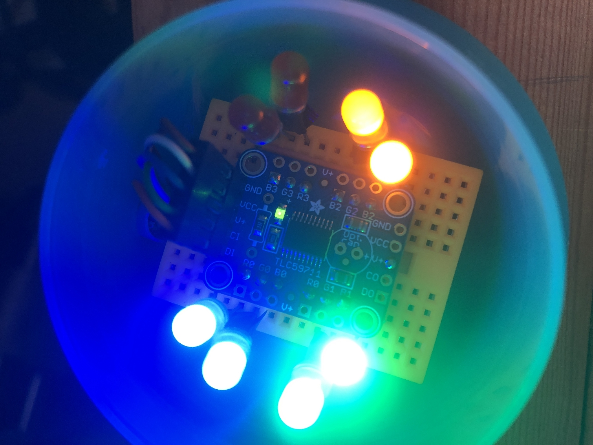
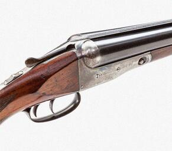

# Parker

Parker will help you to stop your vehicle so you don't ram into the garage shelves. Think of this as the electronic
tennis-ball-on-a-string for your garage's perplexing parking problems. It uses an ultrasonic distance sensor and a LED controller to
alert you about how close you get to the target zone.

Here's how it works. 

  1. Buy an Arduino, some LEDs, a tilt sensor or some kind of contact switch of your choice, an Adafruit TLC59711 and an ultrasonic
sensor.  
  1. Wire the contact switch so when your garage door opens, it will close the contact. Put on your thinking cap and get out the
drill.  
  1. Attach the ultrasonic sensor in front of your parking spot. You'll need to know how far the car should stop from that spot.  
  1. Attach red, yellow, green and blue LEDs to the TLC59711 and attach that in a clear box that meets your visibility requirements,
not to mention your high taste.  
  1. Run all these wires from the remote gizmos into a pretty little box that will hold your Arduino.  
  1. Program your Arduino with this sketch, tweaked to your distance specs.

## Usage

In my garage, I have a mercury tilt switch on a little lever that lifts up when the door opens all the way. That closes the contact
and it is that signal that fires up the Arduino from its sleep. The ultrasonic sensor starts listening for the reflections from the
bumper of the car as it comes into the garage. Once it gets into the first distance "bucket" it lights the blue LEDs and as the car
progresses into the garage, the other LED pairs start to light up. I programmed the TLC to light the LED pairs a bit at a time so
you can see about how far you are in the distance "bucket." 

## Code requirements

This sketch requires at least three components, if you don't put the Arduino to sleep, which you can easily remove if you want.

   - SPI.h - for communication between the Arduino and the TLC59711
   - Adafruit_TLC59711.h - for the LED controller
   - Ultrasonic.h - for simple acoustic range finding
   - LowPower.h - for reducing power consumption while the door is closed (optional)

I stuck the controller on one of those mini breadboards and wired it into a plastic makeup container with a translucent cover. Here's
a photo of my as-built LED setup. Leads and resistors are under the board. The translucent cover is great because it makes the light
from the LEDs more diffuse and more visible.

### Possible configurations

You can use this code with a minimum of the ultrasonic detector and LEDs on the Arduino pins. You don't need to power down the
Arduino, either, so you could do without the contact switch. Look in the examples directory for code.

##### History

Tommy Hill had a Parker shotgun and he named his Airedale, Parker, after his shotgun. Both were really cool. Hat tip to Tommy and to
Parker, who was so smart he could probably have parked your car.

